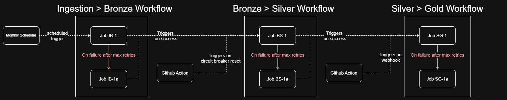

# Architecture Decision Records

## ADR-001 — Databricks + dbt as the main stack

**Context**
Project designed to demonstrate proficiency with the dominant tools 
in the data engineering market in 2026.

**Decision**
Databricks as the execution and storage platform (Delta Lake), 
dbt for Silver → Gold transformations.

**Reasons**
- Databricks and dbt are the two most in-demand tools on mid/senior 
  Data Engineer job offers in France
- Databricks natively provides Delta Lake, Spark, and an orchestration 
  engine (Workflows) — no additional tooling required
- dbt on Databricks is the most widespread pattern for analytical 
  transformations — it cleanly separates business logic (dbt SQL) 
  from ingestion logic (Python)

**Alternatives considered**
- AWS Glue + Redshift: rejected, less dominant on the French market
- Spark standalone + Airflow: set aside for now — this 
  combination will be the main constraint of a dedicated future project

**Note**
The stack choice is not driven by project constraints — the data volume 
and complexity do not strictly require it. It is a deliberate upskilling 
decision on market-dominant tools, independent of the actual technical 
need. In real conditions, stack selection would be driven by business 
and infrastructure constraints, not the other way around.

## ADR-002 — Incremental ingestion strategy vs full reload

**Context**  
The main data source is the SIRENE stock file (INSEE), updated monthly,
containing all French business establishments. Two ingestion strategies
were possible to keep the lakehouse up to date each month.

**Key figures**  
- 42.9M establishments in France in the full stock file (as of March 2026)
- 4.5M establishments in Auvergne-Rhône-Alpes (~10.5%)
- 1.7M active establishments in AURA
- ~36,500 monthly modifications in AURA via the SIRENE delta API

**Decision**  
Hybrid ingestion:
- One-shot initialization from the full stock file (CSV zip), 
  configured via a config file pointing to the source URL
- Monthly updates via the SIRENE API, filtering on 
  dateDernierTraitementEtablissement >= last successful run date
- The stock file last modification date is used as the last successful run date for the first API delta call

**Reasons**  
- Full monthly reload = reprocessing 4.5M rows every run
- Incremental ingestion = reprocessing ~36,500 rows every run
- Ratio: 123x less data processed per monthly run
- The SIRENE API provides a precise filter on last modification date
  — no need to diff files to detect changes
- The stock file URL changes every month — a config file pointing 
  to the source URL is the simplest pragmatic solution at this stage

**Alternatives considered**  
- Full monthly reload from stock file: simpler to implement, no pipeline 
  state management needed — rejected because 123x less efficient
- Stock file initialization via API pagination: technically possible 
  but counterproductive — the API paginates results, making full stock 
  retrieval significantly more complex and slower than directly 
  downloading the stock file

**Known limitation & improvement axis**  
The stock file URL is configured manually. Pointing to an older file 
is not blocking — the first pipeline run will simply capture more months 
of delta than usual, but can become counterproductive if the source file is deprecated for a long time.
This limitation is marginal in practice and only 
relevant in two scenarios: pipeline reinitialization after a major logic 
change, or project duplication with a different business logic.
A future improvement would be to auto-detect the latest stock file URL 
via scraping of the data.gouv dataset page.

**Design implication**  
The pipeline has a start date — historical analysis can only go back
to the first batch. This makes early pipeline launch strategically important.

**Pipeline state management — enabling precise API delta filtering**  
The pipeline maintains execution state to determine the reference date 
for each API delta call — ensuring only changes since the last 
successful run are retrieved. Full rationale in ADR-00X.

## ADR-003 — Bronze → Silver → Gold architecture

**Context**  
Having chosen an incremental ingestion strategy (see ADR-002),
a storage architecture was needed to support the core business case
and ensure pipeline reliability.

**Decision**  
Medallion architecture: Bronze → Silver → Gold.
Bronze retention is conditional — a batch is deleted from Bronze 
immediately once successfully transformed into Silver.

**Why a medallion architecture**  
The combination of a data pipeline feeding a BI use case naturally 
calls for a medallion architecture — it provides standard separation 
of concerns between raw data transit (Bronze), historized and validated 
data (Silver), and business-ready aggregations (Gold). Each layer 
addresses a distinct responsibility that cannot be substituted by another.

**Why Bronze as a transit-only layer**  
The business case requires month-over-month trend analysis —
answering questions like "is this sector growing or declining over time?"
requires reconstructing establishment state at any past date.
SCD Type 2 is the pattern that enables this, by storing each state
with its validity period rather than overwriting the current record.

Since the SIRENE source is a SCD Type 1 table — each establishment has a
single current state record, with no built-in history — transforming it
into SCD Type 2 means Silver already captures the full historical record
from the moment the pipeline was launched.

Therefore, the Bronze layer's sole purpose is to hold raw API batches
between ingestion and Silver transformation, ensuring no batch is lost
in case of failure between the two steps. Once a batch is successfully
transformed into Silver, it is deleted from Bronze — it has no long-term
storage role and no analytical value that Silver cannot already provide.

**Layers**  
- Bronze — transit zone: Delta Lake table, append-only, partitioned by `batch_id`
- Silver — historical source of truth: SCD Type 2 table accumulating monthly state snapshots since pipeline launch
- Gold — business aggregations: set of dbt models producing sector/region trend indicators for business consumption

## ADR-004 — Delta Lake as the storage format

**Context**  
The choice of Databricks as the execution platform (see ADR-001) makes 
Delta Lake the default storage format — Databricks is built around Delta Lake 
and the two are deeply integrated. This ADR documents the validation that 
Delta Lake is compatible with the project's actual constraints, rather than 
justifying the choice from scratch.

**Constraints to validate**  
- **ACID transactions** : the SCD Type 2 transformation requires an UPDATE 
  (close existing record) followed by an INSERT (new state). If the pipeline 
  fails between the two, Silver is corrupted. Each individual statement must 
  be fully committed or fully rolled back.
- **Columnar format** : Silver → Gold transformations are aggregation-heavy 
  (sector/region counts over time) — columnar storage maximizes query 
  performance for this access pattern.
- **dbt compatibility** : dbt is used for Gold transformations — 
  the storage format must be supported by a mature dbt connector.

**Validation**  
- Atomicity at the individual statement level is guaranteed — a write that 
  fails mid-way is fully rolled back, preventing partial writes or corrupted files.
- Delta Lake is built on Parquet — natively columnar.
- `dbt-databricks` is the most mature and feature-complete dbt connector 
  for this stack.

Delta Lake satisfies all three constraints — and is the natural choice 
in a Databricks environment.

**Note**  
In a platform-agnostic context, Iceberg or Hudi would have been 
equally valid candidates. At the scale of this specific project, 
DuckDB + Parquet would even have been technically sufficient.
  
Also, Delta Lake provides more than strictly needed — time travel and versioning — but these are acceptable overhead given the storage 
volumes involved (~36,500 rows per monthly batch). Versioning retention 
is kept at default (30 days) as the marginal storage cost does not 
justify configuration overhead.

## ADR-005 — Cloudflare R2 as primary storage

**Context**  
An S3-compatible object storage accessible from Databricks was needed 
to host three distinct components:
- The Bronze transit layer (temporary batch holding between API ingestion 
  and Silver transformation)
- The Delta Lake medallion layers (Silver + Gold)
- The pipeline config file (stock file URL for initialization)

**Decision**  
Cloudflare R2 as the primary storage for the project.

**Storage capacity validation**  
- Bronze transit layer: ~10 Mo max per batch, deleted once successfully 
  transformed into Silver — at monthly frequency, accumulation to a 
  critical storage level within any reasonable timeframe is not a concern
- Silver init (1.7M active AURA establishments): ~300 Mo
- Silver monthly delta (~36,500 rows SCD Type 2): ~10 Mo/month
- Gold (sector/region aggregations): ~20 Mo
- Delta Lake versioning (30 days retention): ~20 Mo
- Total after 12 months: ~450-500 Mo — well within R2 10 GB free tier

**Reasons**  
- Natively S3-compatible API — boto3 works without any code modification
- 10 GB free tier with no time limit — no expiration unlike AWS 
  free tier (6 months maximum)
- No egress fees — relevant for frequent reads from Databricks

**Alternatives considered**  
- AWS S3: rejected — free tier limited to 6 months, account expired
- Azure Blob Storage: rejected — requires the Azure SDK rather than 
  boto3, adding an unnecessary dependency given R2's native S3 
  compatibility. Additionally, Azure Blob charges egress fees 
  and its free tier is time-limited (12 months), both disadvantages 
  compared to R2.
- DBFS (Databricks File System): rejected — tight coupling to Databricks, 
  not representative of a real-world architecture

## ADR-006 — Pipeline failure handling strategy  

**Context**  
A failure handling strategy was needed across the entire pipeline to ensure:
- No batch is ever lost between ingestion and Silver transformation
- The pipeline recovers automatically from transient failures at every stage
- Logic failures are caught, isolated, and resolved without data loss 
  or Silver corruption

Additionally, the pipeline must be able to detect and act on a human 
signal indicating a logic fix has been applied, without requiring 
direct access to Databricks nor R2.

**Failure handling by pipeline stage**  

*API → Bronze (ingestion)*  
- **Transient failure** (API or R2 down): handled by native Databricks 
  retry with incremental delay. If max retries reached, the run is 
  marked as failed and an alert is sent. The batch is not written to 
  Bronze — the next scheduled run will capture the missed changes via 
  the delta API filter, at the cost of a larger delta window.
- **Logic failure** (unexpected API response structure): Schema evolution 
  is enforced at the Bronze level — any schema change from the INSEE API 
  is accepted and written to Bronze as-is. This guarantees no batch is 
  ever lost due to a schema change. If the new schema breaks the Silver 
  transformation, the DLQ handles it downstream.
- **Idempotence**: guaranteed by a MERGE on the Bronze macrobatch table — 
  replaying an ingestion produces no duplicates.

*Bronze → Silver (transformation)*  
- **Transient failure** (R2 down, instance crash): handled by native 
  Databricks retry. Idempotence of the transformation guarantees safe 
  accidental reprocessing.
- **Logic failure** (e.g. schema evolution in Bronze breaking Silver 
  transformation logic): the batch is sent to the DLQ. A circuit breaker 
  halts the pipeline — no subsequent batch is processed until the failing 
  batch is resolved. The circuit breaker is reset exclusively by a human 
  operator without requiring direct access to Databricks or the storage 
  layer — the reset is triggered from the version control system once 
  the fix has been pushed.
- **Idempotence**: guaranteed by an idempotence condition on the Silver 
  transformation sequence — accidental reprocessing of an already-transformed 
  batch produces no duplicate or corrupted records (see ADR-T).
- **Ordering guarantee**: when a batch fails, all subsequent batches 
  are queued — none are processed until the failing batch is resolved. 
  This enforces strict chronological ordering of Silver SCD Type 2 
  snapshots, which is a hard requirement for month-over-month trend 
  analysis (see ADR-003).

*Silver → Gold (dbt)*  
- **Transient failure** (R2 down, instance crash): handled by native 
  Databricks retry, no manual intervention required.
- **Logic failure** (broken or updated dbt model): non-destructive and 
  non-blocking — Silver is intact, other Gold tables are unaffected. 
  A fix or update to Gold transformation files triggers an automatic 
  recalculation, with no direct access to Databricks required.
- **Idempotence**: naturally guaranteed by the nature of dbt aggregation 
  models — replaying a dbt run always produces the same result.

**DLQ design — Bronze → Silver only**  
The DLQ is scoped to the Bronze → Silver transformation — the only stage 
where logic failures can cause data loss or Silver corruption if not handled.

Failure granularity is at batch level. The business case is built on 
long-term trend analysis — the BI layer is not time-sensitive to the 
point where partial monthly updates would bring meaningful value. 
Even at higher pipeline frequencies, partial batch processing would 
only make sense if the number of failing lines were small enough to 
produce a meaningful partial snapshot — which is unlikely to be 
consistently the case. Batch-level granularity is therefore the 
right tradeoff, and a full batch reprocess (~36,500 rows at monthly 
frequency) is acceptable in compute and storage.

**Alternatives considered**  

*Schema enforcement at Bronze level:*  
Would reject any batch with an unexpected schema — simpler to implement 
but risks losing batches on INSEE schema changes. Rejected in favor of 
schema evolution — no batch is worth losing over a schema change that 
the DLQ can handle downstream.

*Direct Databricks access to reset the circuit breaker:*  
Rejected — couples the maintenance act to a specific technical skill 
and access level, inconsistent with the principle that maintenance 
requires no direct access to the orchestration layer.

*Auto-reset by code version change detection:*  
Would automatically reset the circuit breaker when a new code version 
is deployed. Rejected — no reliable way to confirm a new version 
actually fixes the failing batch. A deliberate human reset signal 
is an acceptable and safer tradeoff.

*Line-level quarantine:*  
See DLQ design section above.

## ADR-007 — Databricks Workflows as the orchestration layer  

**Context**  
The pipeline requires an orchestration layer capable of handling:
- Scheduled monthly ingestion
- Automatic two-phase retry on transient failures at every stage
- Circuit breaker pattern halting the pipeline on logic or unexpected 
  failures, reset exclusively by a human operator
- Automatic pipeline resumption after a human-triggered reset, 
  without requiring direct access to Databricks
- Automatic Silver → Gold recalculation on dbt model changes

**Why Airflow is the best candidate on paper**  
Apache Airflow natively addresses all constraints above:
- Cron-based scheduling with fine-grained control
- Built-in retry with exponential backoff per task
- Sensor pattern — tasks that poll a condition and trigger downstream 
  tasks when the condition is met, which would natively handle circuit 
  breaker detection and pipeline resumption without custom implementation
- Native integration with external triggers and webhooks
- Large ecosystem, battle-tested in production data pipelines

Prefect and Dagster offer similar capabilities with more modern interfaces, 
but Airflow remains the most widely adopted in enterprise data engineering contexts.

**Why not Airflow**  
Introducing Airflow alongside Databricks would add a full orchestration 
stack to deploy, maintain, and secure — a significant operational overhead 
for a pipeline that runs monthly. The complexity of integrating two 
platforms outweighs the elegance of Airflow's native sensor pattern 
in this context.

Additionally, Databricks is the imposed platform for this project 
(see ADR-001). Databricks Workflows is capable of addressing all 
constraints without sacrificing pipeline quality or functionality — 
solving the orchestration problem within Databricks alone demonstrates 
deeper platform proficiency than delegating it to an external tool.

**How constraints are addressed with Databricks Workflows**  

*Two-phase retry pattern*  
Every job in every workflow follows the same retry pattern:
- **Phase 1** (Job X): short retry — X attempts, Y seconds interval
- **Phase 2** (Job Xa): long retry — unlimited attempts, Z hours 
  interval + alert

This pattern is implemented via Databricks Workflows conditional task 
execution — Job Xa is triggered `on failure` of Job X after max retries 
are reached. Job X and Job Xa run the same code with different retry 
configurations.

*Circuit breaker*  
The pipeline halt mechanism is implemented via a flag in the pipeline 
state store. When set, all Bronze → Silver workflow runs exit immediately 
at startup — no transformation is attempted. The flag is reset exclusively 
via a dedicated GitHub Action triggered manually by the operator, which 
calls a reset job via the Databricks API (see ADR-006).

*Granular state tracking in Bronze → Silver*
The Bronze → Silver transformation sequence (write Silver, check data 
integrity, delete Bronze batch) cannot be guaranteed atomic across three 
distinct operations. In case of UnexpectedFailure mid-sequence, the pipeline 
state store records the current stage for each batch being processed — 
allowing the operator to determine precisely whether a manual Silver 
rollback is needed or whether a simple pipeline restart is safe.

*Inter-workflow triggering*  
Workflows are fully decoupled — each workflow is triggered independently:
- Ingestion → Bronze : triggered by monthly scheduler
- Bronze → Silver : triggered by Ingestion → Bronze Job 1 on success, 
  or by the GitHub Actions reset job on circuit breaker reset
- Silver → Gold : triggered by Bronze → Silver Job 2 on success + 
  empty ingestion queue, or by GitHub Actions webhook on dbt model changes

*Silver → Gold recalculation*  
A push to Gold transformation files in the repository triggers an 
automatic call to the Silver → Gold workflow via a GitHub Actions webhook, 
without requiring any human access to Databricks.

**Workflow and job structure**  
  
*(see pipeline job logic section below for job-level implementation)*  

  
**Pipeline job logic**  
═══════════════════════════════════════════════════════  
WORKFLOW : INGESTION → BRONZE  
═══════════════════════════════════════════════════════  

JOB IB-1 [short retry: X attempts, Y seconds interval]  
JOB IB-1a [long retry: unlimited, Z hours interval + alert]  
───────────────────────────────────────────────────────  
```
try:  
    Fetch API data filtered on last successful run date  
    Write to Bronze — MERGE on siret + batch_date for idempotence  
    Trigger Bronze→Silver Workflow  

except TransientFailure:  
    raise  → triggers retry  

except UnexpectedFailure:  
    Send critical alert — potential batch loss risk  
    raise  → triggers retry  
```

═══════════════════════════════════════════════════════  
WORKFLOW : BRONZE → SILVER  
═══════════════════════════════════════════════════════  

JOB BS-1 [short retry: X attempts, Y seconds interval]  
JOB BS-1a [long retry: unlimited, Z hours interval + alert]  
───────────────────────────────────────────────────────  
```
try:
    If pipeline is halted → exit 0

    For each batch in Bronze ingestion queue, ordered chronologically:
        Record stage = "processing" in pipeline state store
        Capture current Silver version for potential rollback

        Transform batch — UPDATE open records + INSERT new records
        Write to Silver
        Record stage = "written" in pipeline state store

        Check data integrity on Silver

        If integrity check FAILS:
            Restore Silver to captured version
            Set pipeline halted
            Send alert with integrity report
            exit 0

        Record stage = "checked" in pipeline state store
        Delete processed Bronze batch from ingestion queue
        Record stage = "deleted" in pipeline state store

    Trigger Silver→Gold Workflow

except TransientFailure:
    raise  → triggers retry

except LogicFailure | UnexpectedFailure:
    Set pipeline halted
    Send alert — include current stage from pipeline state store 
                 to indicate whether manual Silver rollback is needed
    exit 0
```

═══════════════════════════════════════════════════════  
WORKFLOW : SILVER → GOLD  
═══════════════════════════════════════════════════════  

JOB SG-1 [short retry: X attempts, Y seconds interval]  
JOB SG-1a [long retry: unlimited, Z hours interval + alert]  
───────────────────────────────────────────────────────  
```
try:
    Capture current Gold versions for potential rollback
    Record stage = "captured" in pipeline state store

    Run dbt build (run + test per model)
    Record stage = "built" in pipeline state store

    If dbt result contains failures:
        Restore failed Gold tables to captured versions
        Record stage = "restored" in pipeline state store
        Send alert with dbt failure report
        exit 0

except TransientFailure:
    raise  → triggers retry

except UnexpectedFailure:
    Set pipeline halted
    Send critical alert — include current stage from pipeline state store
                         to indicate whether manual Gold rollback is needed
    exit 0  
```

## ADR-008 — Python modular scripts over notebooks  

**Context**  
Databricks supports two approaches for writing pipeline code: 
interactive notebooks and standard Python scripts. A choice was needed 
for the production pipeline codebase.

**Decision**  
Python modular scripts organized as a package, versioned in Git. 
Notebooks are reserved for exploration, debugging, and setup documentation.

**Reasons**  

*Testability*  
Python modules can be unit tested — functions are importable and 
testable in isolation. Notebooks cannot be unit tested without 
dedicated tooling that adds significant complexity.

*Clean versioning*  
Python scripts produce readable Git diffs — line-by-line changes 
are immediately understandable. Notebooks are serialized as JSON 
including outputs and metadata, producing noisy and largely unreadable 
diffs that make code review and change tracking impractical.

*Reusability*  
A function defined in a Python module is importable anywhere in the 
codebase — ingestion logic, transformation logic, and utilities can 
be shared across jobs without duplication. Notebook code cannot be 
imported directly.

*CI/CD compatibility*  
Python scripts can be linted, tested, and deployed automatically 
in a CI/CD pipeline. This enables automated quality checks on every 
push — syntax errors, style violations, and unused imports are caught 
before deployment.

*Maintainability*  
A modular structure with clear separation of concerns 
(ingestion, transformation, utils) makes the codebase easier to 
navigate, extend, and debug than a collection of notebooks.

**Where notebooks remain useful**  
- Interactive data exploration and prototyping
- Debugging pipeline issues interactively on live data
- Setup and onboarding documentation (e.g. `docs/setup_cluster.ipynb`)