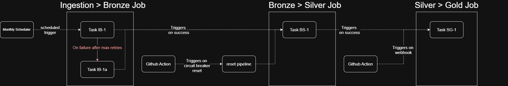

# insee-sirene-monitor

End-to-end data pipeline on French business registry data (SIRENE/INSEE) for economic activity monitoring in a custom region.

## Overview

This pipeline ingests monthly updates from the SIRENE API, historizes establishment data using a SCD Type 2 pattern, and produces business-ready aggregations for trend analysis. It is designed as a portfolio project demonstrating proficiency with the dominant tools in the data engineering market.

**Business questions addressed:**
- Is a given sector growing or declining in the custom region?
- Have business creations in a specific industry slowed since a given date?
- Which departments are the most economically dynamic for a given sector?

## Customization

The pipeline is designed to be highly configurable from a single config file:

- **Geographic scope** — any region can be targeted by updating a department list
- **Tracked columns** — each source column is individually configured as project-historized (triggers a new SCD2 period on change), fixed (updated retroactively across all historical rows), or ignored. Adding a new column to Silver tracking is a single config entry — the pipeline adapts automatically.
- **Historization strategy** — the distinction between project-historized and fixed columns allows fine-grained control over what constitutes a "meaningful change" vs a data correction, without touching the transformation logic
- **Gold models** — dbt models are independent and can be added, removed, or modified without touching the ingestion or transformation logic

## Stack

- **Platform** : Databricks Serverless (Free Edition)
- **Storage** : Unity Catalog Volumes + Delta Lake
- **Transformations** : Python (Bronze → Silver) + dbt (Silver → Gold)
- **Orchestration** : Databricks Jobs + GitHub Actions

## Architecture

Medallion architecture : Bronze → Silver → Gold

- **Bronze** : transit layer — raw INSEE API batches, deleted once successfully transformed. Acts as an implicit dead letter queue on transformation failure.
- **Silver** : historical source of truth — SCD Type 2, accumulating monthly state snapshots since pipeline launch. Initialized from the INSEE stock and historical stock files at first run.
- **Gold** : business aggregations — three dbt models:
  - `gold_sector_trends` — monthly sector dynamics by department (active count, creations, closures, reopenings)
  - `gold_regional_activity` — department-level dynamism score and net growth by sector
  - `gold_active_establishments` — snapshot of currently active establishments with coordinates for mapping

Architecture and implementation decisions are documented in [DECISIONS.md](DECISIONS.md).

## Data source

- **INSEE SIRENE API** — monthly delta updates filtered on last treatment date
- **Stock file** — one-shot initialization from data.gouv.fr (full establishment stock, ~42.9M rows France-wide, ~5M in AURA)
- **Historical stock file** — one-shot initialization of past periods for multi-period establishments

Geographic scope: Auvergne-Rhône-Alpes (12 departments).

## Pipeline behavior

- **Initialization** (`first_fetch`): downloads stock and historical files, filters on AURA, builds Silver with full SCD2 history from INSEE data. Run automatically on first pipeline trigger if Silver does not exist.
- **Monthly run** (`fetch` + `bronze_to_silver`): fetches delta from INSEE API, writes to Bronze, transforms to Silver via atomic Delta MERGE.
- **Gold refresh** (`silver_to_gold`): triggered automatically after each Silver update, or on push to dbt model files.

## Job architecture



## Failure handling

- **Ingestion failures**: two-phase retry (short + long) with email alert
- **Transformation failures**: circuit breaker halts the pipeline, reset via GitHub Actions manual trigger
- **Gold failures**: automatic rollback via Delta time travel, email alert

## Project Setup

See [docs/setup_project.ipynb](docs/setup_project.ipynb) for full setup instructions.

## Project structure
```
ingestion/          # first_fetch.py, fetch.py  
transform/          # bronze_to_silver.py, silver_to_gold.py  
utils/              # config, pipeline state, spark helpers  
tasks/              # Databricks task entry points  
dbt/                # Gold models (sector_trends, regional_activity, active_establishments)  
jobs/               # Databricks Job YAML definitions  
.github/workflows/  # GitHub Actions (reset circuit breaker, retrigger Gold)  
docs/               # setup_cluster.ipynb  
DECISIONS.md        # Architecture Decision Records  
```
